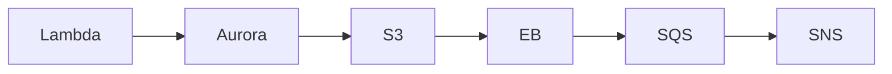

# InfraTales | AWS DataSync DMS Step Functions CDK: Building a Multi-Environment Migration Pipeline That Does Not Fail Silently

**AWS CDK (TYPESCRIPT) reference architecture — platform pillar | advanced level**

> Moving data between AWS environments — dev, staging, prod — sounds simple until you're doing it at scale with heterogeneous sources: S3 buckets, Aurora relational data, and search indexes in OpenSearch, all needing to stay in sync without manual intervention or production downtime. Teams typically bolt together ad-hoc scripts, cron jobs, and one-off DMS tasks that work once and break silently on the second run. The real pain is orchestration: knowing which service moves which data, what fires when a stage fails, and how to prove to auditors that the right data landed in the right environment.

[](LICENSE)
[](CONTRIBUTING.md)
[](https://aws.amazon.com/)
[-IaC-purple.svg)](https://aws.amazon.com/cdk/)
[](https://infratales.com/aws-datasync-dms-step-functions-cdk-migration-pipeline/)
[](https://infratales.com)


## 📋 Table of Contents

- [Overview](#-overview)
- [Architecture](#-architecture)
- [Key Design Decisions](#-key-design-decisions)
- [Getting Started](#-getting-started)
- [Deployment](#-deployment)
- [Docs](#-docs)
- [Full Guide](#-full-guide-on-infratales)
- [License](#-license)

---

## 🎯 Overview

The stack provisions a multi-service migration pipeline using AWS DataSync for S3-to-S3 bulk transfers [from-code], DMS for Aurora relational data migration [from-code], and custom Glue jobs for ETL transformation between environments [from-code]. Step Functions orchestrates the full migration sequence — DataSync task → Glue transform → DMS replication → OpenSearch index rebuild — with EventBridge triggering runs on schedule or on S3 event [from-code], SNS and SQS handling failure notifications and dead-letter routing [from-code], and Lambda functions acting as glue logic between orchestration steps [from-code]. The non-obvious design choice is using Step Functions as the single control plane across four fundamentally different migration services rather than letting each service self-trigger, which centralizes failure handling but creates a single orchestration bottleneck [editorial]. IAM roles are scoped per service with least-privilege boundaries [from-code], and VPC placement with EC2 is required for DMS replication instances and DataSync agents running inside the private network [inferred].

**Pillar:** PLATFORM — part of the [InfraTales AWS Reference Architecture series](https://infratales.com).
**Target audience:** advanced cloud and DevOps engineers building production AWS infrastructure.

---

## 🏗️ Architecture



> 📐 See [`diagrams/`](diagrams/) for full architecture, sequence, and data flow diagrams.

> Architecture diagrams in [`diagrams/`](diagrams/) show the full service topology (architecture, sequence, and data flow).
> The [`docs/architecture.md`](docs/architecture.md) file covers component responsibilities and data flow.

---

## 🔑 Key Design Decisions

- Step Functions as the single orchestrator gives you one place to audit migration state, but a failed state machine execution blocks the entire pipeline — DataSync, DMS, Glue, and Lambda all stall together until the failure is manually resolved or retried [inferred]
- DMS for Aurora migration adds continuous replication capability but requires a persistent EC2-backed replication instance running 24/7, costing ~$70-150/month even when no migration is active — a dedicated migration schedule with instance start/stop logic would cut this significantly [inferred]
- Using DataSync over S3 native replication (CRR) gives you task-level control and bandwidth throttling, but DataSync charges per GB transferred (~$0.0125/GB) on top of S3 request costs, which adds up fast if you're syncing multi-TB datasets frequently [editorial]
- OpenSearch index rebuilds triggered by Step Functions are full reindex operations, not incremental — acceptable for environment promotion cadences but catastrophic for any scenario where the source cluster is unavailable mid-migration [inferred]
- Glue jobs in the middle of the pipeline introduce cold-start latency (2-10 minutes for DPU allocation) that makes this pipeline unsuitable for near-real-time environment sync requirements [inferred]

> For the full reasoning behind each decision — cost models, alternatives considered, and what breaks at scale — see the **[Full Guide on InfraTales](https://infratales.com/aws-datasync-dms-step-functions-cdk-migration-pipeline/)**.

---

## 🚀 Getting Started

### Prerequisites

```bash
node >= 18
npm >= 9
aws-cdk >= 2.x
AWS CLI configured with appropriate permissions
```

### Install

```bash
git clone https://github.com/InfraTales/<repo-name>.git
cd <repo-name>
npm install
```

### Bootstrap (first time per account/region)

```bash
cdk bootstrap aws://YOUR_ACCOUNT_ID/YOUR_REGION
```

---

## 📦 Deployment

```bash
# Review what will be created
cdk diff --context env=dev

# Deploy to dev
cdk deploy --context env=dev

# Deploy to production (requires broadening approval)
cdk deploy --context env=prod --require-approval broadening
```

> ⚠️ Always run `cdk diff` before deploying to production. Review all IAM and security group changes.

---

## 📂 Docs

| Document | Description |
|---|---|
| [Architecture](docs/architecture.md) | System design, component responsibilities, data flow |
| [Runbook](docs/runbook.md) | Operational runbook for on-call engineers |
| [Cost Model](docs/cost.md) | Cost breakdown by component and environment (₹) |
| [Security](docs/security.md) | Security controls, IAM boundaries, compliance notes |
| [Troubleshooting](docs/troubleshooting.md) | Common issues and fixes |

---

## 📖 Full Guide on InfraTales

This repo contains **sanitized reference code**. The full production guide covers:

- Complete AWS CDK (TYPESCRIPT) stack walkthrough with annotated code
- Step-by-step deployment sequence with validation checkpoints
- Edge cases and failure modes — what breaks in production and why
- Cost breakdown by component and environment
- Alternatives considered and the exact reasons they were ruled out
- Post-deploy validation checklist

**→ [Read the Full Production Guide on InfraTales](https://infratales.com/aws-datasync-dms-step-functions-cdk-migration-pipeline/)**

---

## 🤝 Contributing

See [CONTRIBUTING.md](CONTRIBUTING.md) for guidelines. Issues and PRs welcome.

## 🔒 Security

See [SECURITY.md](SECURITY.md) for our security policy and how to report vulnerabilities responsibly.

## 📄 License

See [LICENSE](LICENSE) for terms. Source code is provided for reference and learning.

---

<p align="center">
  Built by <a href="https://www.rahulladumor.com">Rahul Ladumor</a> | <a href="https://infratales.com">InfraTales</a> — Production AWS Architecture for Engineers Who Build Real Systems
</p>
